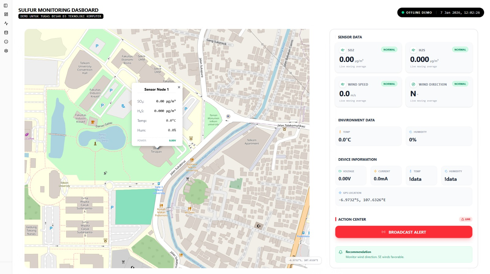

# Field Monitoring with Realtime Map Dashboard

## Cara Kerja

```
ESP32 -> USB SERIAL -> Python backend -> HTTP REST API dan WEBSOCKET -> Frontend
```

ESP32 family mengirimkan char melalui USB Serial yang kemudian akan dibaca oleh script python. Script python sekaligus menjadi API yang menyediakan data sensor. Data sensor dikirimkan melalui koneksi HTTP RESTFUL dan WEBSOCKET yang akan dibaca oleh Aplikasi berbasis WEB secara Lokal. 

---

### Tech Stack
#### Backend
Teknologi yang digunakan:
- FastAPI -> MiddleCORS atau pembuat API 
- pyserial -> menerima data USB serial dari ESP32
#### Frontend
- Vite: build tools untuk frontend
- React: framework
- TailwindCSS V4
- Shadcn-ui: UI components seperti `button`, `sidebar`

---

## Persiapan Sebelum Development
Windows / Linux anda sudah terinstall:
- Node JS dan NPM. Dianjurkan versi LTS. Link: https://nodejs.org/en/download
- Python. Link: https://www.python.org/downloads/
- Git. Link: https://git-scm.com/install/windows

Istilah yang perlu anda ketahui:
- Terminal folder navigation
- Perbedaan React Framework vs HTML CSS Javascript
- Vite.js dan UI components untuk React
- Python Virtual environment
- HTTPs Restful dan Websocket 
- `npm` dan `pip` packages
- USB Serial Monitor dan cara kerjanya
- Library: pyserial, FastAPI
- penggunaan `.gitignore` supaya repositori tidak bengkak

---

# Development

## Clone Repository 
Clone repository ini dan navigasi ke foldernya.
```
git clone https://github.com/bokumentation/STASRG-SulfurMonitoring-Software.git
cd STASRG-SulfurMonitoring-Software
```

Berikut struktur folder dan penjelasannya.
```txt
📁backend   -> tempat backend 
📁frontend  -> tempat frontend
📁src       -> hiraukan saja, ini untuk README repo
.gitignore  -> konfigurasi gitignore 
README.md
```


## Setup Backend
Teknologi yang digunakan:
- FastAPI -> MiddleCORS atau pembuat API 
- pyserial -> menerima data USB serial dari ESP32

#### Setup
1. Navigasi ke folder `backend`.
    ```bash
    cd backend
    ```
2. Buat Python Virtual Environment dan aktifkan (sesuaikan OS anda).
    ```bash
    python -m venv venv
    source venv/bin/activate
    ```
3. Install `requirements.txt` menggunakan `pip`.
    ```bash
    pip install -r requirements.txt
    ```

#### Konfigurasi USB Serial (WAJIB)
Note: Gunakan sesuai jenis OS dan Mikrokontroler yang digunakan. Saya menggunakan Debian(linux), silahkan disesuaikan dengan OS anda. Contoh: Di Windows seharusnya COM X, bisa dicek di `Device Manager`

Lokasi kode ada di `app/api.py`
```python
# --- UBAH SERIAL PORT SESUSAI OS DAN MICROCONTROLLER ---
SERIAL_PORT = "/dev/ttyACM0"  # ESP32C3
# SERIAL_PORT = "/dev/ttyUSB0" # HELTEC ESP32S3
BAUD_RATE = 115200
```

#### Jalankan Backend
Jalankan backend Python
```bash
python main.py
```

Contoh output jika berhasil membaca serial monitor.

```
(venv) ➜  backend git:(main) ✗ python main.py
INFO:     Will watch for changes in these directories: ['/home/loq/git/STASRG-SulfurMonitoring-Software/backend']
INFO:     Uvicorn running on http://127.0.0.1:8000 (Press CTRL+C to quit)
INFO:     Started reloader process [145115] using WatchFiles
INFO:     Started server process [145128]
INFO:     Waiting for application startup.
--- APP STARTUP ---
INFO:     Application startup complete.
--- SUCCESS: Serial Port Opened on /dev/ttyACM0 ---
```
---

## Setup Frontend

#### Setup
Setelah kita setup backend, langkah selanjutnya adalah menjalankan frontend. Berikut langkah2nya.

1. Navigasi ke folder `frontend`.
    ```bash
    cd frontend
    ```
2. Install package menggunakan `npm`.
    ```bash
    npm install
    ```
3. Jalankan menggunakan perintah `run dev`.
    ```bash
    npm run dev
    ```
4. Aplikasi akan jalan di `http://localhost:5173/`.
    Contoh output:
    ```
    ➜  frontend git:(main) ✗ npm run dev

    > frontend@0.0.0 dev
    > vite

    VITE v7.3.0  ready in 159 ms

    ➜  Local:   http://localhost:5173/
    ➜  Network: use --host to expose
    ➜  press h + enter to show help

    ```

Sekarang, masuk ke browser. ketikan `http://localhost:5173/`. Seharusnya langsung masuk ke halaman dashboard.



Happy coding!