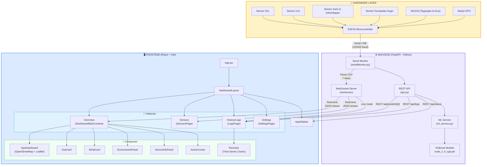
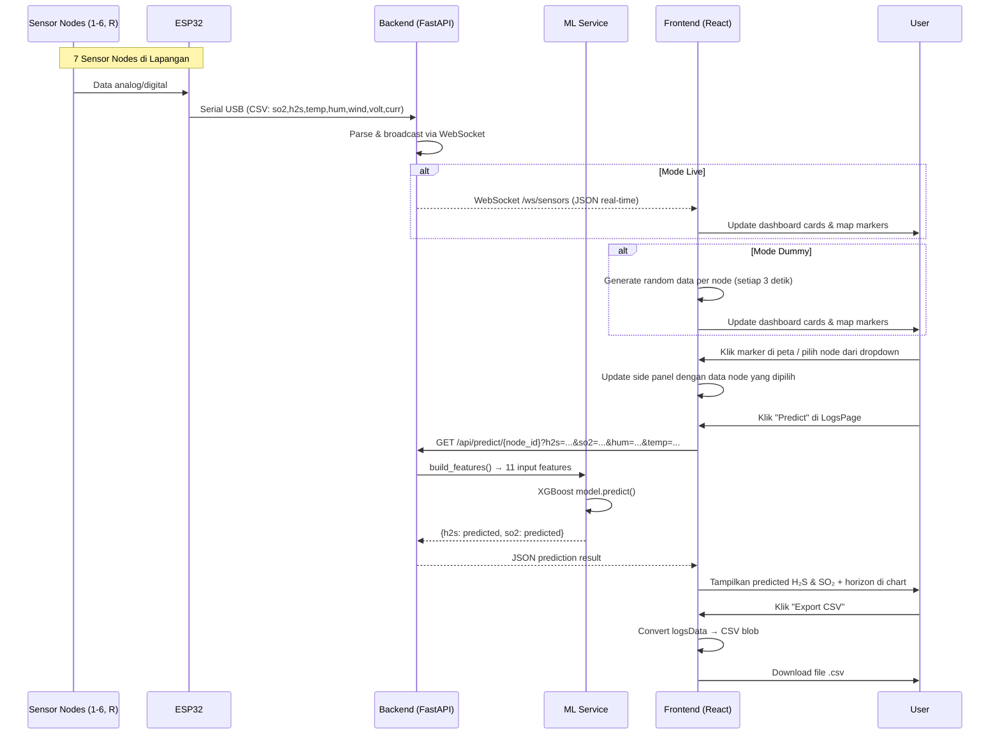
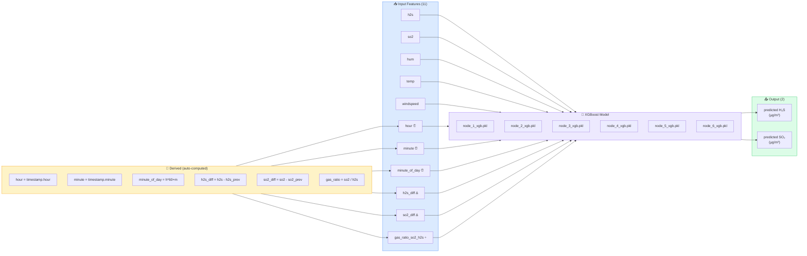

# Diagram Blok Sistem — STASRG Sulfur Monitoring Software

## 1. Arsitektur Keseluruhan Sistem



---

## 2. Alur Data (Data Flow)



---

## 3. Struktur File Proyek

```
STASRG-SulfurMonitoring-Software/
│
├── backend/                          # ⚙️ FastAPI Backend
│   ├── main.py                       # Entry point, lifespan, CORS
│   ├── requirements.txt              # Dependencies
│   ├── models/                       # 🤖 ML Models
│   │   ├── node_1_xgb.pkl
│   │   ├── node_2_xgb.pkl
│   │   ├── node_3_xgb.pkl
│   │   ├── node_4_xgb.pkl
│   │   ├── node_5_xgb.pkl
│   │   └── node_6_xgb.pkl
│   └── app/
│       ├── __init__.py
│       ├── api.py                    # REST + WebSocket endpoints
│       ├── ml_service.py             # Model loading & prediction
│       └── serialMonitor.py          # Serial port reader (standalone)
│
├── frontend/                         # 🖥️ React Frontend
│   └── src/
│       ├── App.jsx                   # Root component
│       ├── lib/
│       │   └── api.js                # Axios instance (base: /api)
│       └── components/
│           ├── DashboardLayout.jsx    # Layout + routing
│           ├── DashboardMainContent.jsx  # Overview page
│           ├── AppSidebar.jsx         # Navigation sidebar
│           ├── GpsDashboard.jsx       # OpenStreetMap + Leaflet
│           ├── GasCard.jsx            # SO₂/H₂S value cards
│           ├── WindCard.jsx           # Wind direction card
│           ├── EnvironmentPanel.jsx   # Temp & humidity panel
│           ├── DeviceInfoPanel.jsx    # Device info display
│           ├── ActionCenter.jsx       # Action buttons
│           └── pages/
│               ├── SensorsPage.jsx    # 7-node sensor grid
│               ├── LogsPage.jsx       # Charts + ML prediction
│               └── SettingsPage.jsx   # Settings
│
└── src/                              # 📊 ML Training (notebooks)
```

---

## 4. Detail ML Pipeline



---

## 5. Sensor Nodes — Lokasi Geografis

| Node | Latitude | Longitude | ML Model |
|------|----------|-----------|----------|
| Node 1 | -7.166870 | 107.401387 | ✅ `node_1_xgb.pkl` |
| Node 2 | -7.167397 | 107.401775 | ✅ `node_2_xgb.pkl` |
| Node 3 | -7.167415 | 107.402914 | ✅ `node_3_xgb.pkl` |
| Node 4 | -7.166614 | 107.403483 | ✅ `node_4_xgb.pkl` |
| Node 5 | -7.166418 | 107.404100 | ✅ `node_5_xgb.pkl` |
| Node 6 | -7.166833 | 107.404111 | ✅ `node_6_xgb.pkl` |
| Node R | -7.167099 | 107.404272 | ❌ Tidak ada model |

---

## 6. API Endpoints

| Method | Endpoint | Deskripsi |
|--------|----------|-----------|
| `GET` | `/api/status` | Cek status backend & koneksi serial |
| `WS` | `/api/ws/sensors` | WebSocket real-time sensor data stream |
| `GET` | `/api/models/status` | Cek model ML yang ter-load |
| `GET` | `/api/predict/{node_id}` | Prediksi H₂S & SO₂ untuk satu node |
| `POST` | `/api/predict/all` | Prediksi untuk semua node (1-6) |
| `POST` | `/api/predict/batch` | Prediksi per-node dengan fitur berbeda |

---

## 7. Tech Stack

| Layer | Teknologi |
|-------|-----------|
| **Hardware** | ESP32, Sensor SO₂/H₂S, Anemometer, INA219, GPS |
| **Backend** | Python, FastAPI, Uvicorn, PySerial |
| **ML** | XGBoost, Scikit-learn, NumPy |
| **Frontend** | React, Vite, TailwindCSS |
| **Peta** | Leaflet, OpenStreetMap |
| **Grafik** | Recharts (AreaChart, LineChart) |
| **Komunikasi** | WebSocket (real-time), REST API (request-response) |
